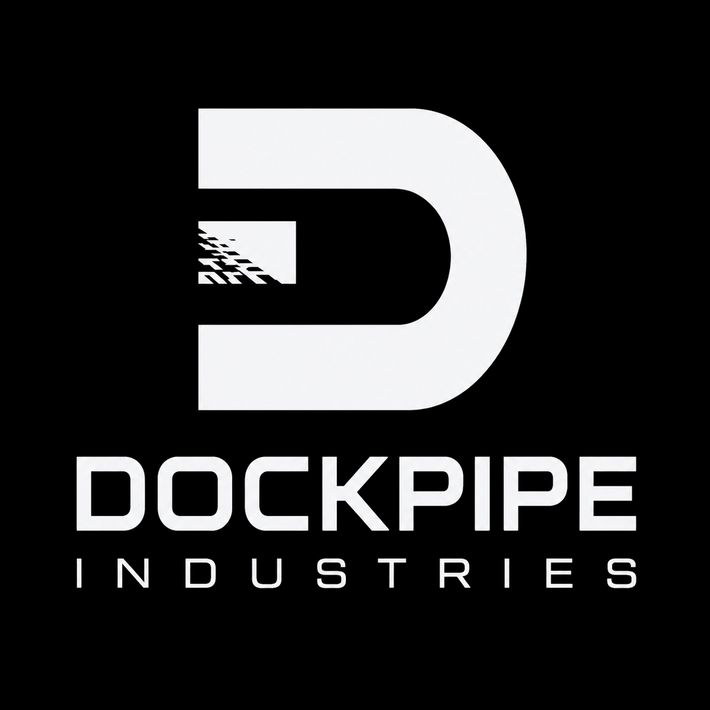

<!-- markdownlint-disable MD033 -->

  

  <h1>Engineering systems for ambitious work.</h1>

  

    We build governed infrastructure that helps people and machines 
    create, operate, and scale with confidence.
  

---

## Our first foundation: DockPipe

[DockPipe](https://github.com/Dockpipe-Industries/dockpipe) is the foundational open-source platform developed by DockPipe Industries.

It began with a simple premise: a command should be able to run in a clean, disposable environment without forcing its author to hand-build the surrounding machinery. From that primitive, DockPipe grows into a governed runtime for reusable workflows, packages, CI jobs, AI workers, and deployable tooling.

DockPipe reflects the company principles in working software:

- **one clear execution primitive;**
- **isolation by default;**
- **composable workflows and packages;**
- **separation between intent, environment, tooling, and lifecycle;**
- **explicit verification and authority boundaries;**
- **open-source foundations that can be inspected and extended.**

  <a href="https://github.com/Dockpipe-Industries/dockpipe"><strong>Explore DockPipe -></strong></a>
  &nbsp;&middot;&nbsp;
  <a href="https://github.com/Dockpipe-Industries/dockpipe/blob/master/docs/README.md"><strong>Read the documentation -></strong></a>
  &nbsp;&middot;&nbsp;
  <a href="https://github.com/Dockpipe-Industries/dockpipe/releases"><strong>View releases -></strong></a>

## Our purpose

DockPipe Industries is a long-horizon engineering company focused on the infrastructure behind complex work.

We believe powerful systems should remain understandable. Automation should remain accountable. Tools should compose instead of becoming cages. Whether work is performed by a developer, a CI system, an AI agent, or a future industrial platform, its intent and boundaries should remain clear.

Our purpose is to turn complexity into systems people can **understand, repeat, govern, and trust**.

> **Build the foundations that let ambitious work move safely from idea to operation.**

## Our vision

The next generation of infrastructure will be operated by humans and machines together.

People will define intent, priorities, and acceptable risk. Software and autonomous systems will carry out increasingly sophisticated work. The organizations that succeed will not be those with the most automation, but those that can make automation dependable—observable when it runs, constrained when it acts, and accountable for what it changes.

We are building toward a world where:

- sophisticated execution is portable rather than trapped in one platform;
- automation is governed by explicit boundaries rather than implicit trust;
- tools, environments, and workflows compose without losing their identities;
- every important operation leaves evidence that can be inspected and understood;
- humans remain responsible for direction while machines expand what is possible;
- infrastructure can evolve from software-scale coordination toward larger operational and industrial systems.

## What we believe

### Humans lead. Machines execute.

Automation should extend human judgment, not obscure it. Intent, authority, and consequential decisions must remain visible even when execution becomes autonomous.

### Boundaries create confidence.

Isolation, permissions, approval gates, and clear lifecycle limits are not friction to remove. They are what make powerful systems safe enough to use.

### Composable systems outlast monoliths.

The strongest foundations are built from small parts with precise responsibilities. Each component should do one job well and connect cleanly to the next.

### Evidence beats assumption.

Important work should produce durable, inspectable proof: inputs, outputs, decisions, verification, and state transitions. Trust grows from what a system can demonstrate.

### Portability preserves freedom.

Execution intent should not be inseparable from one vendor, machine, operating system, or deployment model. Infrastructure should travel as requirements change.

### The long term matters.

We optimize for systems that can be understood, maintained, and extended years from now. Durable architecture is a strategic advantage.

## What we build

DockPipe Industries develops foundational technology across a set of connected horizons:

| Horizon | Focus |
| --- | --- |
| **Execution infrastructure** | Reliable ways to run commands, tools, and workflows across isolated environments. |
| **Governed automation** | Explicit authority, verification, artifacts, and approval boundaries for consequential work. |
| **Human + machine operations** | Systems where people set direction and autonomous workers execute within reviewable contracts. |
| **Portable platforms** | Composable foundations that can move across local machines, CI, cloud infrastructure, and future substrates. |
| **Industrial-scale systems** | Applying the same principles of isolation, observability, resilience, and controlled flow to increasingly complex operations. |

These are our direction of travel—not a claim that every layer is already a finished product. We prefer to build the primitive, prove it under real use, and expand from evidence.

## How we work

### Primitive first

We begin with the smallest useful capability, make its contract clear, and build upward through composition.

### Open where foundations matter

Foundational infrastructure benefits from scrutiny. DockPipe is developed in public under the Apache License 2.0 so its execution model can be inspected, challenged, and improved.

### Cross-platform by design

Real systems do not live on one operating system or in one environment. Portability is considered at the architecture level, not added as a final compatibility pass.

### Safety as architecture

Security and governance cannot be bolted onto autonomous or operational systems after the fact. Authority, isolation, verification, and failure behavior belong in the design.

### Build, use, learn

We dogfood what we create. Real operation reveals what diagrams cannot, and those lessons should flow back into simpler contracts and stronger foundations.

## Why “Industries”

The name reflects the horizon.

We are building software today, but our interest is broader than another developer tool. We care about the systems that coordinate resources, environments, machines, and people—the operational layer that turns intent into dependable action.

The same principles that make software automation trustworthy also matter in larger systems: controlled inputs, clear boundaries, observable state, resilient execution, and accountable outcomes.

DockPipe Industries exists to pursue that path deliberately.

## Build the future carefully

We are early, and we intend to earn the scope of the vision one reliable layer at a time.

If you care about composable infrastructure, governed AI, portable execution, dependable automation, or the future of human-machine operations, follow our work here on GitHub.

   
  <strong>Human direction. Machine execution. Systems you can trust.</strong>
    
  <a href="https://github.com/Dockpipe-Industries">DockPipe Industries on GitHub</a>

